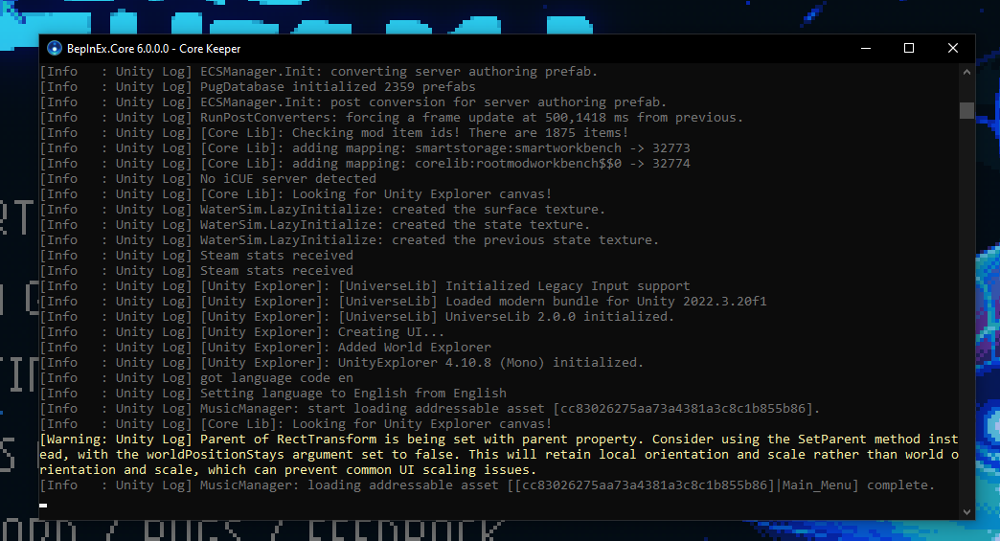

# Viewing Console Logs

As you may have noticed when inspecting the ItemExample's SpawnItemOnStart script, in addition to spawning an item, it also prints "Spawn Sword1" to the game's debug logs. This section will explain how to view those logs.

## Log Files

The `Player.log` file in your [log files directory](../../concepts/important-folder-paths.md#log-files) contains log messages from the active (or previous, if the game is currently closed) game session. Open it up and ensure you can find the "Spawn Sword1" message using your favorite text editor's Find utility.

## Viewing Logs at Runtime

### Use BepInEx to view logs

A recommend way to easily view logs in real time is using BepInEx console. It will open together with the game and you will be able to see all logs there.

<figure><figcaption>
BepInEx console in action
</figcaption></figure>

Setup steps:

1. Download BepInEx 6.0.0-pre.2 from [github](https://github.com/BepInEx/BepInEx/releases/download/v6.0.0-pre.2/BepInEx-Unity.Mono-win-x64-6.0.0-pre.2.zip) ([repo](https://github.com/BepInEx/BepInEx))
2. Open game installation [directory](../../concepts/important-folder-paths.md#game-install-directory), and extract downloaded archive into game folder.&#x20;
3. Ensure you see `CoreKeeper.exe` and a folder on the same level called `BepInEx`

Note: BepInEx console has some limitations, specifically if you log from threads other than main (That often happens if you log from jobs) you won't see them. To see them you will have to watch `Player.log`

### Use Text Editor to view logs

Viewing the logs in real time requires a text editor that can handle opening a file read-only without locking it. Consider [Klogg](https://klogg.filimonov.dev/) or [Notepad++](https://notepad-plus-plus.org/).
