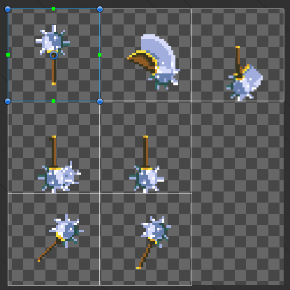

# Weapons and Tools

## Follow the Item Guide

Follow the steps in the generic item guide first to define the other required properties of your item.


[.](./)


## Creating Melee Weapons and Tools

To make a equipable item with use animation you need to:

* Set the `ObjectType` to tool or weapon type
* Add `DurabilityAuthoring`, `GivesConditionsWhenEquipedAuthoring`, `CooldownAuthoring`, `WeaponDamageAuthoring` and `LevelAuthoring` component authorings and configure them correctly
* Assign both icons to first sprite in item animation sheet.

Sprite sheets should be 120x120px and have 7 sprites showing item in different states. You can find such sheets for all base game weapons and tools by ripping game content via [Asset Ripper](../../modding-tools/asset-ripper.md).

<figure><figcaption>
Screenshot of an example weapon sprite sheet
</figcaption></figure>

## Creating Ranged Weapons


The [CoreLib.Entity submodule](../../modding-libraries/corelib.md) is required for this guide section.


To make a ranged weapon you mostly need to do the same as with any other weapon. Except for the fact that you will need a custom projectile entity added. To hook modded projectile entity use `ModRangeWeaponAuthoring` component instead of `RangeWeaponAuthoring` (CoreLib feature)
