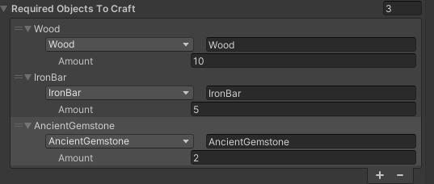

# Adding Crafting Recipe

To a basic crafting recipe open Item Entity prefab and expand Required Objects To Craft. Increase the size of the list to the needed amount and then proceed to select each item.

<figure><figcaption>
Example crafting recipe
</figcaption></figure>

To add a modded item as a crafting ingredient enter its `Object Name` in the field.


Warning: defining the crafting recipe does not mean players will now be able to obtain it.

For that to happen you must assign it to one of many existing workbenches or make your own.

