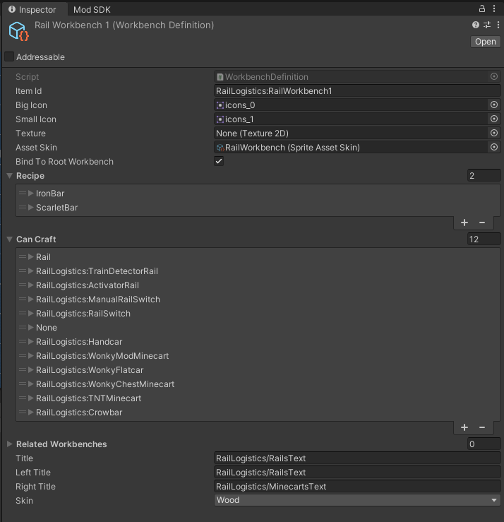
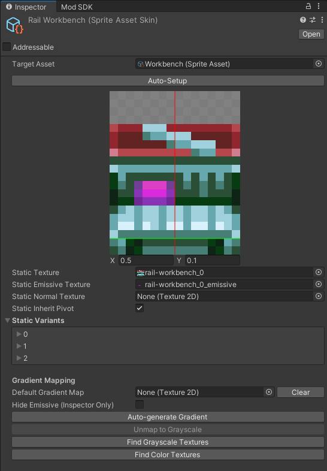

# Adding your items to crafters

## Existing Crafting buildings

One way to make your item obtainable is to add it to already existing workbench. Please be aware that each workbench can have AT MOST 18 slots. You cannot exceed this value. As such this approach isn't too scaleable.

To do so add the following code to your `IMod` class:


Following snippet makes use of [CoreLib](../../modding-libraries/corelib.md) library


```csharp
public const string MODNAME = "Example mod";
public const string VERSION = "1.0.0";

public static Logger Log = new Logger(MODNAME);

// You might already have this method
// if so, just add method body to your code
public void EarlyInit() 
{
    Log.LogInfo($"Mod version: {VERSION}");

    API.Authoring.OnObjectTypeAdded += EditWorkbench;

    Log.LogInfo($"{MODNAME} mod is loaded!");
}

private static void EditWorkbench(
    Entity entity, 
    GameObject authoring, 
    EntityManager entityManager
){
    ObjectID objectID = authoring.GetEntityObjectID();
    
    // This will determine what workbench we are targeting 
    // In this case it is Solarite Workbench
    if (objectID != ObjectID.SolariteWorkbench) return;
    
    // This is the item we will be adding
    var targetItem = "ExampleMod:ExampleItem"

    var canCraftBuffer = entityManager.GetBuffer<CanCraftObjectsBuffer>(entity);
    var item = API.Authoring.GetObjectID(targetItem);

    for (int i = 0; i < canCraftBuffer.Length; i++)
    {
        if (canCraftBuffer[i].objectID == item) return;
        if (canCraftBuffer[i].objectID != ObjectID.None) continue;
        
        Log.LogInfo($"Adding itemId {targetItem} to {objectID}");
        canCraftBuffer[i] = new CanCraftObjectsBuffer
        {
            objectID = item,
            amount = 1,
            entityAmountToConsume = 0
        };
        break;
    }
}
```

Please note that values returned by API.Authoring.GetObjectID() are not static and will change between game launches. Do not try to hardcode it or save it.

## Adding a custom workbench


The [CoreLib.Entity submodule](../../modding-libraries/corelib.md) is required for this guide section.


CoreLib.Entity submodule allows to easily add custom workbenches. All you have to do is define it via a special Scriptable Object.

Create a new Workbench definition by right clicking in project tab and selecting `Create -> CoreLib -> New Workbench Definition`

<figure><figcaption><p>Example Workbench Definition (Source: WIP Mod Rail Logistics)</p></figcaption></figure>

### Workbench Definition fields

There are following fields to fill out:

* Item ID - the same as Object Name in Object Authoring, refer to [this](../../common-concepts/unique-names-and-ids.md)
* Icons - two sprites the player will see in inventory
* Asset Skin - An Asset skin for a workbench, defines how the workbench will look in the world
* Recipe - What is required to make the workbench
* Can Craft - Most important section. Here you can list everything players will be able to find in the workbench. You can only at most **18** slots!
* Related Workbenches - Any workbenches listed here (Modded via Workbench Definition) will be considered related and ingame you will see up and down arrows that allow switching between these.
* Titles - Text that will be displayed on top of workbench UI. Must be localized, refer to [this](../items/#item-localization)
* Skin - Visual appearance of workbench UI

Ensure you have added localization texts for your workbench as described [here](../items/#item-localization)

### Create Sprite Asset Skin

To create Sprite Asset Skin open create menu and select `Create -> 2D -> Sprite Asset Skin`. Assign `Target Asset` property. The sprite you want to select is `Workbench`, and is bundled with CoreLib Package.

<figure><figcaption><p>Example Sprite Asset Skin (Source: WIP Mod Rail Logistics) </p></figcaption></figure>

Assign main texture (Emmisive optionally) and three variants textures. Refer to original Sprite Asset for how these should look like.

### Register Workbench Definitions

In order for CoreLib to find your mod workbenches add following code to your `IMod` class:

```csharp
public void EarlyInit()
{
    CoreLibMod.LoadModules(typeof(EntityModule));
}

public void ModObjectLoaded(Object obj)
{
    if (obj == null) return;

    if (obj is WorkbenchDefinition workbenchDefinition)
    {
        EntityModule.AddModWorkbench(workbenchDefinition);
        return;
    }
}
```

You are done! Now you should see your workbench in CoreLib's Root Workbench, which can be crafted in player inventory.
