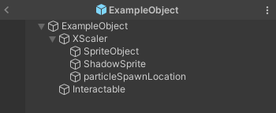
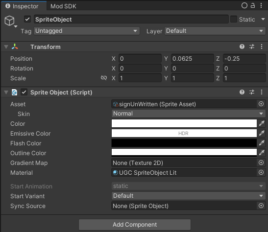
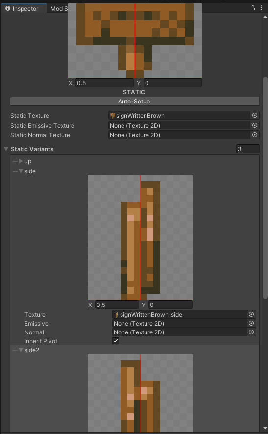
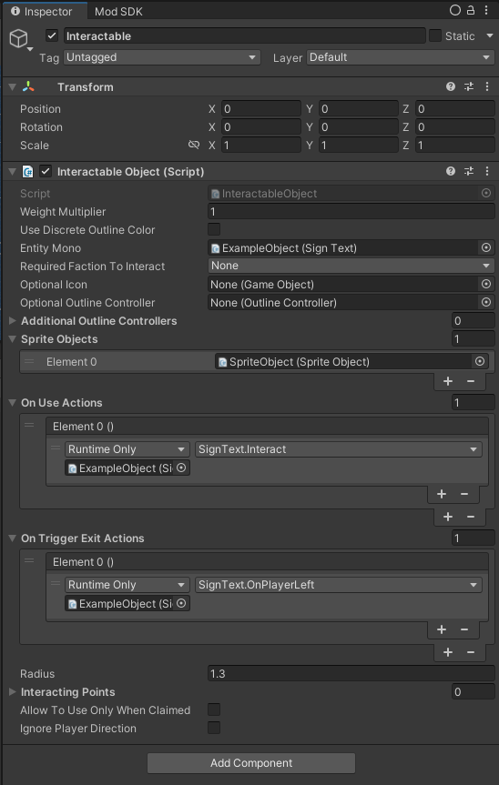
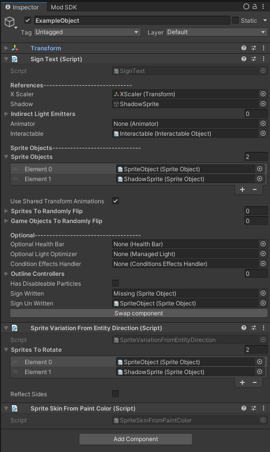

# Placeables

## Placeable Object


The [CoreLib.Entity submodule](../../modding-libraries/corelib.md) is highly recommended for this guide section.



A placeable object is a item with a graphical prefab that can be placed into the world. Player can interact with said object, and it can do various things in the world.

### Making the item

First, follow the steps in the generic item guide to define the other required properties of your entity.


[items](../items/)


Set the `Object Type` to `Placeable Prefab`.&#x20;

#### Assigning components

Add following components:

* `Placeable Object Authoring`. This component allows to set various properties of the object. For example here you can make the object take up more than one tile. It also allows to set on what the object can be placed.
* `Physics Shape`. This will define the collision of the object
* `Ghost Authoring Component`. This is a component that controls your object ghost settings. Ghosts are a NetCode concept and really mean networked object. For most objects keep setting as defaults.
* `Mineable Authoring`
* `Health Authoring`. Set `Health` and `Max Health` to 2
* `Health Regeneration Authoring`
* `Damage Reduction Authoring`. Set `Max Damage Per Hit` to 1
* `State Authoring`
* `Idle State Authoring`
* `Death State Authoring`
* `Took Damage State Authoring`
* `Animation Authoring`
* `Ignore Vertex Offsets`

Optional components:

* `Interactable Authoring`. Enables your object to be interacted with. Ensure your graphical prefab has a Interactable Object component
* `Rotation Authoring`. Allows your object to be rotated
* `Electricity Authoring`. Allows your object to be powered and to power things
* `Supports Pooling` <mark style="color:orange;">(CoreLib)</mark>. Fixes issues you will encounter with Graphical Prefabs. HIGHLY recommended.

### Making the graphical prefab

Graphical prefab is a Game Object that represents the entity on screen. It is important to understand that Graphical prefabs live only on clients, and are only responsible for visual appearance of an entity. They should never encode core behavior of an entity. The only exceptions to this are UI and inventory logic.

To make a graphical prefab create a new Prefab. On the root of it you need to place a `EntityMonoBehaviour` deriven class.


Warning: Do NOT use existing classes that derive from EntityMonoBehaviour in your prefabs. You will have issues if you do.\
\
If you want to use a specific class, make a new class deriving from it, and use that


Then in the hierarchy create a GameObject called `XScaler`. Then inside of it create two GameObjects: `SpriteObject`, `ShadowSprite` and `particleSpawnLocation`. Optionally you can create GameObject `Interactable`, if your object will need to be interacted with. The resulting prefab should look like this:

<figure><figcaption><p>Example graphical prefab</p></figcaption></figure>

On sprite GameObjects add a new component called SpriteObject. On the root component assign fields `X Scaler`, `Shadow` and set list Sprite Objects

#### Making the Sprite Asset

Now create two `Sprite Assets` (Create -> 2D -> Sprite Asset), one for main sprite, one for shadow. In the main one assign your main texture, and in the shadow one assign a shadow texture. Now set these Sprite Assets as the `Asset` field on each of the sprites.

<div data-full-width="false">

<figure><figcaption><p>One of the Sprite Objects set</p></figcaption></figure>

</div>

If you want the object to be rotatable create 3 more static variations: `up` (When facing away from camera), `side` (Facing right) and `side2` (Facing left). Assign their texture to relevant textures. To the root of the prefab add component `Sprite Variation From Entity Direction`. Assign both sprites.

<figure><figcaption></figcaption></figure>

#### Intractability

If you want the object to be interactable, on the `Interactable` GameObject a new component `Interactable Object`. Assign field `Entity Mono`, set sprites in `Sprite Objects` field (Except shadow) and wire up Unity Events `On Use Actions` and `On Trigger Exit Actions` to your root component methods. On the root component assign its field `Interactable`.&#x20;

<figure><figcaption><p>Interactable Object</p></figcaption></figure>

At the end the root of the prefab should look something like this:

<figure><figcaption><p>Graphical Prefab Root</p></figcaption></figure>

Once you are done with the prefab, link it to the `Object Authoring` component.

#### Ensure CoreLib knows about the prefab

Also don't forget to add following code to `ModObjectLoaded()` method in order to fix issues caused by lack of pooling support by default: <mark style="color:orange;">(CoreLib)</mark>

```csharp
if (obj is not GameObject gameObject) return;

var entityMono = gameObject.GetComponent<EntityMonoBehaviour>();
if (entityMono != null)
{
    EntityModule.EnablePooling(gameObject);
}
```

Also ensure you have requested CoreLib to be loaded:

Make sure to call `CoreLibMod.LoadModules(typeof(EntityModule));` to in your mod `EarlyInit()` function, before using the module. This will load the submodule.

## Troubleshooting

### Nothing appears (Can't find the item)

Firstly ensure that your mod is indeed is loading. For that make your IMod class log this, and look for [logs](../../getting-started-modding/viewing-console-logs.md)

If you have Chat Commands installed try watching logs for a log from CoreLib in a format like this: `objectName -> number`. If you see your name in here, your object is ingame.

You might have some issues with the object name working from Chat Commands, to fix this either add a localized name or try using the number you see in that log message from CoreLib.

### My entity seems to be still present after destruction

This is a known issue that devs could fix, but so far don't. Your only way to solve this is to use CoreLib's Entity module, and it's component `SupportsPooling`.

Ensure you have added this component to your entity prefab, and that the grahpical prefab has a unqiue root script that derives from `EntityMonoBehaviour`. (Note: this script MUST be custom, you CANNOT reuse existing scripts)

Lastly ensure you have done [this](./#ensure-corelib-knows-about-the-prefab)
