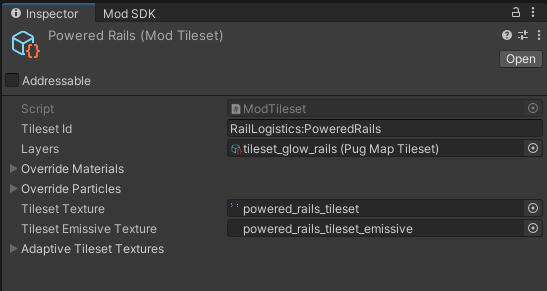

# Tiles


The [CoreLib.Entity and CoreLib.Tilesets submodules](../../modding-libraries/corelib.md) are required for this guide section.


Tiles are special items whose appearance is defined by a tileset. Tiles are not entities and are grouped together by the Tilemap. Tiles cannot have any logic. Exception are `tile-entities`, which are entities with a tile as a visual

When placed they are displayed by a tile system instead of a graphical prefab. This is how one placeable (like walls, floors, bridges, fences, etc) can have many appearances depending on neighbor tiles.

To make custom tileset(s) create a `ModTileset` asset in your Unity project.

<figure><figcaption><p>Example tileset</p></figcaption></figure>

`Tileset Id` is a unique identifier of your tileset that you will need later. Use the format `ModName:TilesetName`. Learn more about Tileset Ids  [here](../../common-concepts/unique-names-and-ids.md).

`Layers` is a reference to a tileset definition asset. CoreLib includes reference assets for three definition assets:

* `tileset_main`
  * Used by biome tilesets. Includes most tiletypes.
* `tileset_base_building`
  * Reduced tileset made specifically for player built things.
* `tileset_extras`
  * Contains various other tiles.

You can make your own Layer asset and assign it here. (Please note that assets provided with core lib are empty placeholders and are replaced at runtime.)

`Tileset Texture` is first texture field. It contains a reference texture for tileset, and contains a variety of different things. Look at vanilla textures to figure out what is what.

`Adaptive Textures` dict contains set of adaptive textures. These are important, as they store variations of your tile as it contacts other tiles. Usually these textures are autogenerated by the game developers of the game. Unfortunately, the modding community does not have info on how they are made, so you will need to reference some of existing ones to make yours.

After setting up the asset add following code to your `ModObjectLoaded()` method:

```csharp
if (obj == null) return;

if (obj is ModTileset tilesetBank)
{
    TileSetModule.AddCustomTileset(tilesetBank);
    return;
}
```

Now you can use `ModTileAuthoring` component to set the tileset and tile type in Editor.
