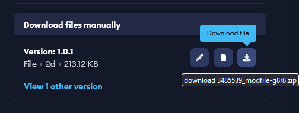

---
layout:
  title:
    visible: true
  description:
    visible: true
  tableOfContents:
    visible: true
  outline:
    visible: true
  pagination:
    visible: false
---

# On Dedicated Servers

Dedicated servers do not have mod.io integration, so mod files must be managed manually.

***

## Manual File Management

1. Download the mods you want from the mod.io website using the Download File button
   * &#x20;
2. Open the game server installation folder and navigate to the [mods folder](../../concepts/important-folder-paths.md#manually-added-mods):  `<server-install-folder>/CoreKeeperServer_Data/StreamingAssets/Mods/`.  You may need to create the `Mods/` folder if it doesn't already exist.
3. Unzip each of the mod zips you downloaded inside the folder so that each mod is in its own subfolder.
   * The name of each mod folder does not matter as long as it is unique, but you probably want it to include the name of the mod for later reference.
   * Ensure that each mod subfolder has a `ModManifest.json` file.
4. Remember to [read the general multiplayer notes](for-multiplayer.md) if you haven't yet. Continue to the next section to help clients get their mods.

## Distributing Mods to your Players

The easiest way to ensure that players have exactly the same mods as the server is to use manual mod installation. This means automatic updates don't cause problems with version mismatches.

1. Set up all of your mods on the server
2. Zip the server's mods directory
3. Have all players [unsubscribe from every mod in the game's mod.io integration](../uninstalling-mods.md)
4. Send your players the zip file and have them unzip it into [their manual mod installation folder](../../concepts/important-folder-paths.md#mod-files).
